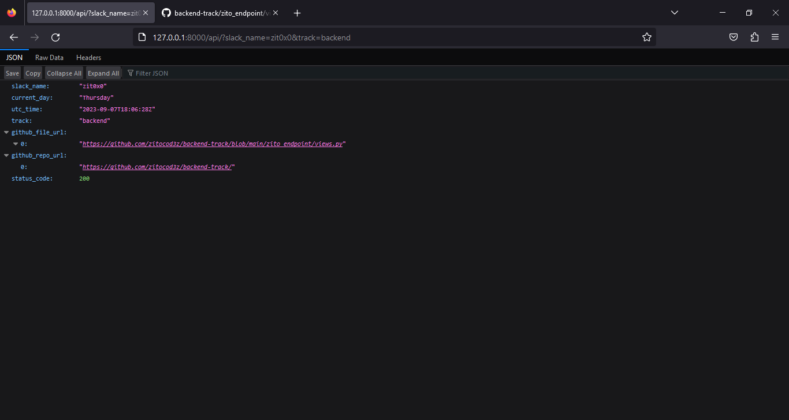

<h1 align="center">Backend-track <em>HNGx</em>(stage one)</h1>
<h3 align="center">An Endpoint that takes two GET parameters i.e <em>slack_name=zit0x0&track=backend</em> and return specific set of information in JSON format</h3>

<h4>To successfully run this program on your local machine, you must have Python 3.6 or > installed on your local machine</h4>
<h4>After cloning this repository, be sure to activate the virtual environment and install the requirements by tunning the command on your machine; pip install requirements.txt.Then run the development server by typing in the command: python manage.py runserver</h4>
<h4><b>Enjoy!!!</b></h4>
